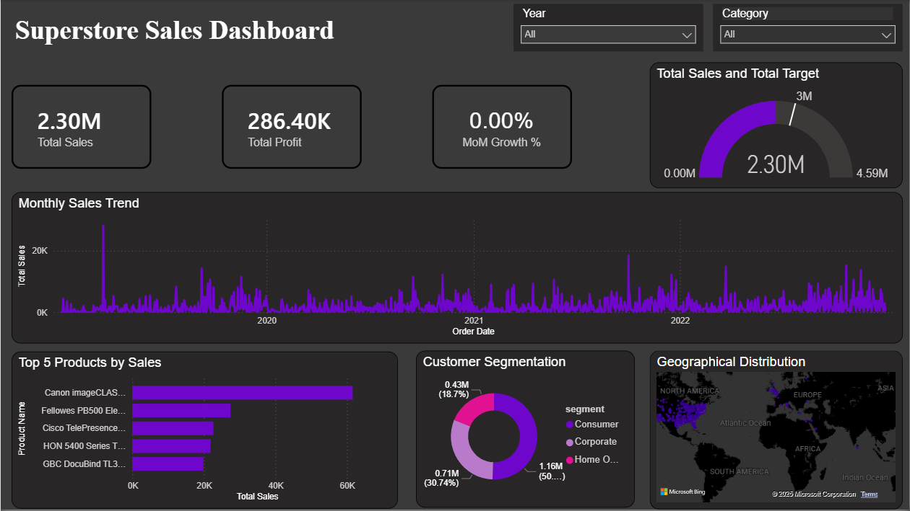

# Superstore Sales Analysis Dashboard 📊

This is a full-stack Business Intelligence project analyzing retail sales data using a **Hybrid Data Model**.

## 🚀 Final Dashboard Preview

## 💡 Key Features
* **Hybrid Data Model:** Connected PostgreSQL (Docker) with Excel targets.
* **Row Level Security (RLS):** Implemented security roles for Regional Managers.
* **Advanced DAX:** Used Time Intelligence for MoM Growth and KPI calculations.
* **UI/UX:** Dark-themed design with custom tooltips and dynamic slicers.

## 🛠️ Tech Stack
* Power BI
* SQL (PostgreSQL)
* Docker
* DAX
